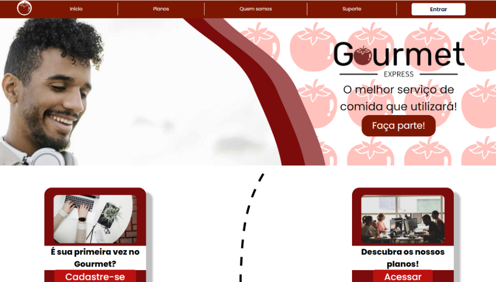

# Gourmet Express

### No dia 26 e 27 de Outubro, inicia-se o evento 'Mundo Senai', onde alunos da rede SESI-SENAI, em forma de grupos, apresentam seus projetos para grupos escolares de diferentes Instituições e redes que fazem parceria com Senai, como a Intelbras. 

### Logo, dentro desse período, foi apresentado o protótipo Gourmet Express, desenvolvido por mim, Nícolas Nichnig e Vinicius Freitas.

### O Gourmet Express é um sistema voltado para donos e funcionários de negócios que envolvem administração de seus estabelecimentos de restaurantes. Além de também funcionar como um cardápio virtual para clientes, onde através de um aplicativo mobile, os clientes realizam seus pedidos e recebem a confirmação de retirada dos pedidos. Por outro lado, os funcionários possuem ações e serviços, disponibilizados em um site exclusivo para esse tipo de usuário, que automatizam ações que são realizadas fisicamente, como atender e confirmar pedidos, administrar registro de estoque de produtos, observação de estatísticas que o próprio Gourmet Express pode oferecer, e sistema de currículo e vagas, para novos funcionários se integrarem em estabelecimentos.

# As ferramentas utilizadas para o projeto foram:
- ### Node.js + Express - Servidor do projeto;
- ### React.js - Visual do site do projeto;
- ### React Native/Expo - Visual do app do projeto;
- ### API Rest - Comunicação entre o site e app com o servidor;
- ### PostgreSQL - Banco de dados onde fica armazenado diferentes dados;

# Link dos repositórios do Gourmet Express

- ### [Servidor](https://github.com/SmartCodeGenius/GourmetExpress-Server)
- ### [App](https://github.com/SmartCodeGenius/Gourmet-Express-RN)
- ### [Site](https://github.com/SmartCodeGenius/Gourmet-Express-React-MVP)